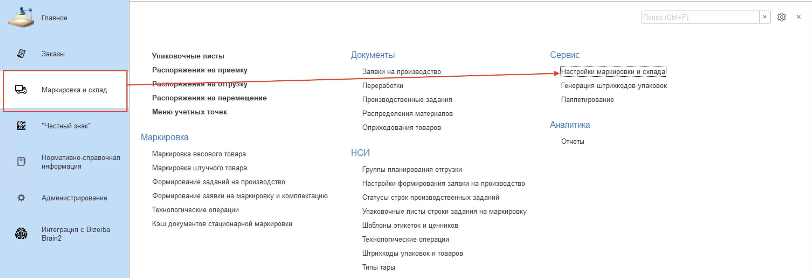
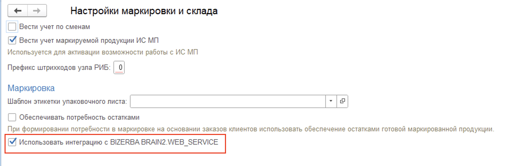
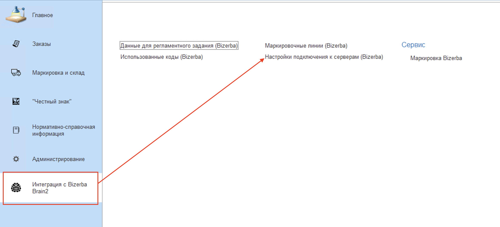
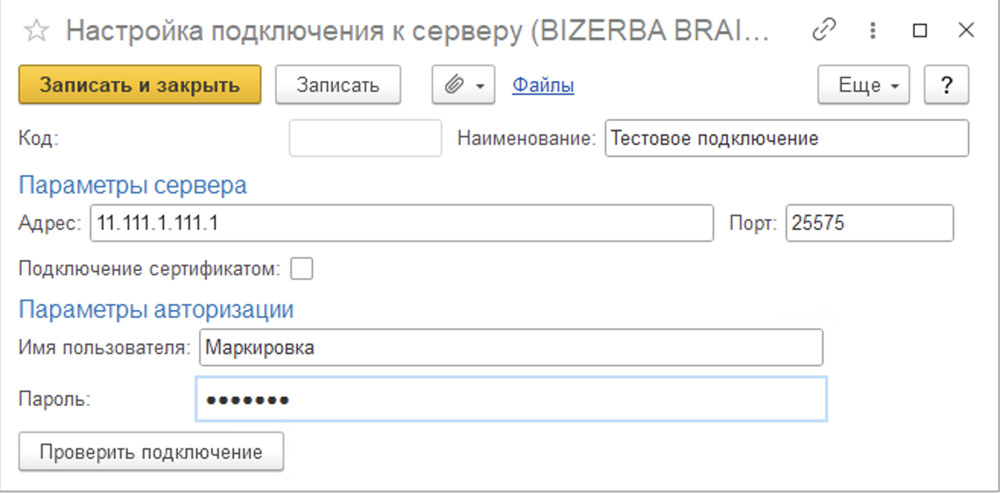
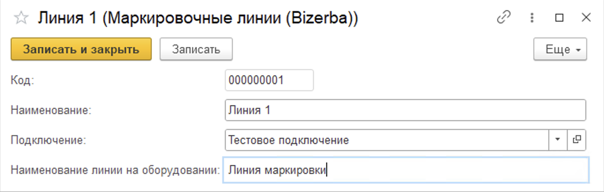
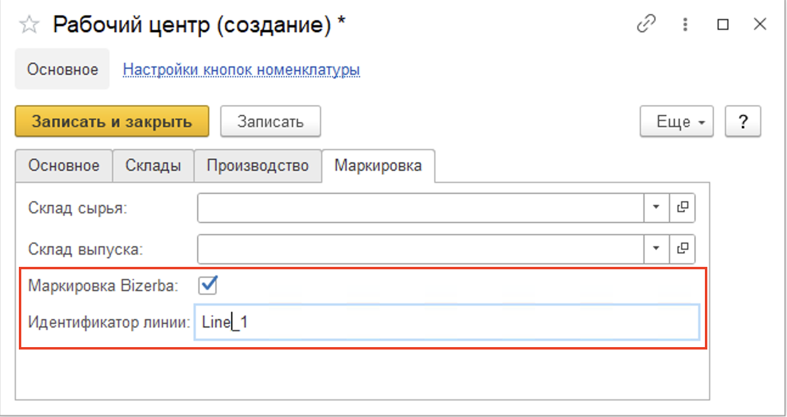

# Настройка интеграции с оборудованием Bizerba

Для подключения подсистемы интеграции с оборудование Bizerba необходимо перейти в **"Настройки маркировки и склада"** расположенной подсистеме **"Маркировка и Склад" - "Сервис"**, а затем активировать функциональную опцию **"Использовать интеграцию с Bizerba"**.

После активации данной функциональной опции появится подсистема **"Интеграция с Bizerba Brain2"**. Далее необходимо перейти в нее и выбрать **"Настройки подключения к серверам (Bizerba)"**.

При создании настройки подключения требуется указать:

- Наименование подключения;
- Адрес подключения и порт;
- Параметры авторизации (Пользователь и пароль);
- Опция подключения сертификатом.

После заполнения данных есть возможность проверить подключение нажатием на кнопку "Проверить подключение".

Как только настройка будет успещно настроена потребуется завести линии маркировки в системе. Потребуется перейти в подсистему **"Интеграция с Bizerba Brain2"** и выбрать **"Маркировочные линии (Bizerba)"**.

При создании линии маркировки указывается:

- Наименование;
- Подключение;
- Наименование линии на оборудовании.

Также для корректного отображения заданий на маркировку в АРМе необходимо указать опцию **"Маркировка Bizerba"** и идентификатор линии в настройках соответствующих рабочих центров.

