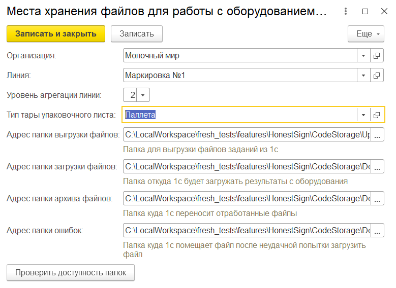
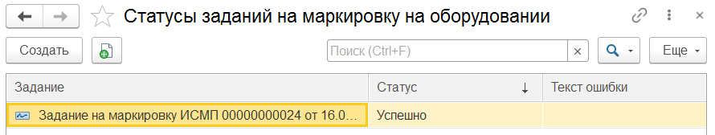

# Настройка интеграции с оборудованием GPS

Все необходимые настройки для работы с оборудованием заполняются  в обработке **"Интеграция с оборудование"** расположенной подсистеме **"Честный знак" - "Сервис"**.

В настройках необходимо указать **Категорию документов gps**:

## "Идентификаторы организаций для оборудования"

- Организация;
- Гуид Отправителя GPS (ГУИД "Константы" в системе поставщика оборудования);
- Гуид Получателя GPS (ГУИД Предприятия в системе поставщика оборудования).

## "Места хранения файлов для работы с оборудованием"

Места хранения файлов заполняются в разрезе Организаций и Линий (рабочих центров). Папки с файлами должны быть доступны с сервера. Для каждого РЦ указывается:

- **Уровень агрегации линии**:

    - **0**: обрабатывается файл **LVL0** и при загрузке создается документ **Переработка** с кодами DataMatrix в штрихкодах;
    - **1**: обрабатывается файл **LVL1** и создаются **Штрихкоды упаковок** для коробов со вложенными кодами DataMatrix. После загрузки код короба попадает в **Переработку**;  
      - **2**: обрабатываются файлы **LVL1** и **LVL2**, для коробов (из файла первого уровня) и для паллет (из файла второго уровня) создаются **Штрихкоды упаковок** с соответствующей вложенностью. В результате загрузки создается документ **Переработка** с кодами **Паллет**. Также необходимо выбрать тип тары упаковочного листа (Тип тары является идентификатором, добавляющий уникальность при выполнении параллельных загрузок).

- **Адрес папки выгрузки файлов** (папка куда будут выгружены файлы из 1С);
- **Адрес папки загрузки** (папка откуда 1с будет загружать файлы полученные с оборудования);
- **Адрес папки архива файлов** (папка куда будут перемешены файлы с результатами печати после удачной обработки в 1с);
- **Адрес папки ошибок** (папка куда будут перемещены файлы с результатами печати после обработки в 1с с ошибкой).

Установить флаг **"Автоматически сохранять файл выгрузки на оборудование"**. При включение данной опции документы будут сохраняться автоматически при выполнении выгрузки в папку в соответствии с РС **"Места хранения файлов для работы с оборудованием"**.

Если опция **"Ввод в оборот одним документом"** активна, то одновременно выполняется ввод в оборот и отчет о нанесении одним документом, а если выключена только отчет о нанесении.

## Работа регламентных заданий

- *Автоматически загружать коды с оборудования* - в случае, если регламентное задание включено, то система будет автоматически подгружать результаты маркировки и создавать документы Переработка.
- *Автоматически загружать отчеты с оборудования* - после того как файл получен с оборудования, в папку загрузки помещается файл об успешном/неуспешном прочтении. При включение данного рег. задания обработка таких файлов происходит автоматически. Результат обработки файлов можно посмотреть в РС **"Статусы заданий на маркировку на оборудовании"**. Ссылка на регистр расположена в пункте *См. также* в обработке **"Интеграция с оборудованием"**

