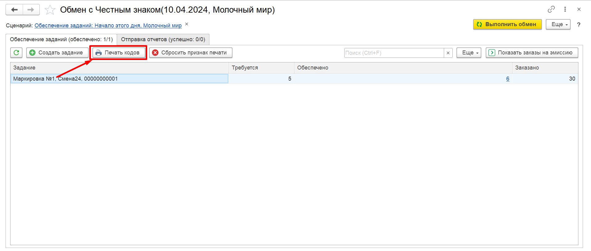
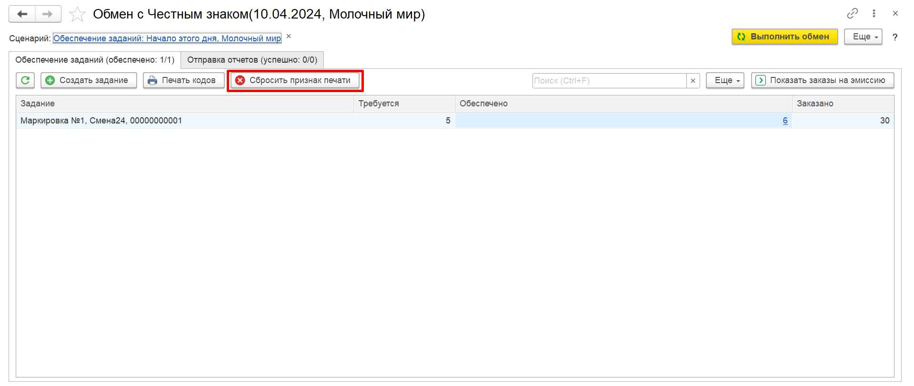

# Печать кодов на основании Задания на маркировку

## Печать кодов

Печать загруженных кодов может производится на основании документа **"Задание на маркировку"**.

Для печати кодов в АРМе **"Обмен с Честным знаком"** выбираем необходимое задание и нажимаем **"Печать"**.

В открывшемся окне указываем какое количество этикеток мы хотим распечатать, шаблон этикетки и нажимаем **"Печать"**.

[![2020-12-22_04-15-27][2020-12-22_04-15-27]][2020-12-22_04-15-27]

Ознакамливаемся с предпросмотром и нажимаем **"Печать"**.

[![2020-12-22_07-53-04][2020-12-22_07-53-04]][2020-12-22_07-53-04]

Для повторной печати предварительно необходимо сбросить признак печати. Для этого выбираем строку с заданием и нажимаем **"Сбросить признак печати"** в самом АРМе.

## Настройка шаблона потребительской этикетки

Формат этикетки для продукции может быть произвольным и включать большое количество информации по мимо кода DataMatrix. Для настройки необходимо воспользоваться Конструктором этикеток:

[![2020-12-22_04-14-33][2020-12-22_04-14-33]][2020-12-22_04-14-33]

[2020-12-22_04-04-17]: based_on_document.assets/2020-12-22_04-04-17.png
[2020-12-22_04-15-27]: based_on_document.assets/2020-12-22_04-15-27.png
[2020-12-22_07-53-04]: based_on_document.assets/2020-12-22_07-53-04.png
[2020-12-22_04-04-59]: based_on_document.assets/2020-12-22_04-04-59.png
[2020-12-22_07-48-57]: based_on_document.assets/2020-12-22_07-48-57.png
[2020-12-22_04-14-33]: based_on_document.assets/2020-12-22_04-14-33.png