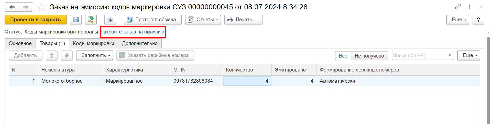
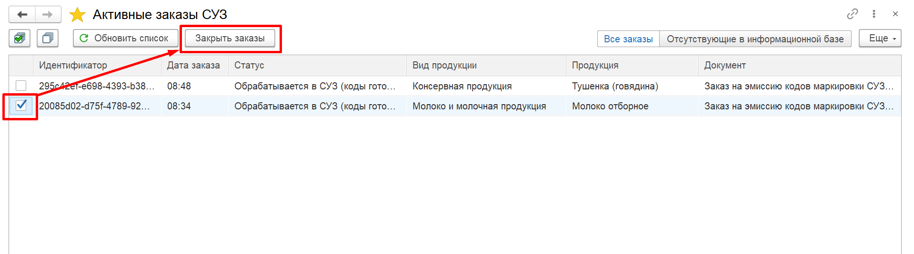

# Закрытие заказов на эмиссию

Успешно обработанные Заказы на эмиссию кодов автоматически закрываются спустя 48 часов, но также есть возможность принудительного закрытия заказов в случае возникновения внештатных ситуаций. Например, такая потребность может возникнуть, если СУЗ переполнен заказами, отсутствующими в информационной базе.

Закрыть заказы можно вручную одним из следующих способов:

- в самом документе "Заказ на эмиссию", нажав на ссылку "Закройте заказ на эмиссию" в виде статуса в шапке:

- на форме "Активные заказы СУЗ" выделить флажками заказы к закрытию по идентификатору/документу и нажать на кнопку "Закрыть заказы":

