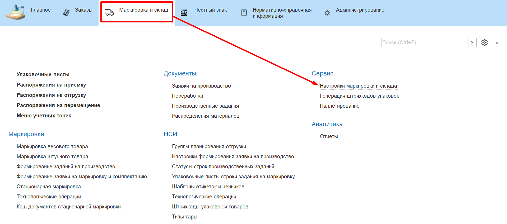
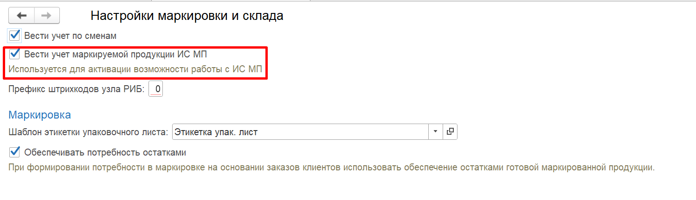

# Настройка интеграции с Информационной системой "Честный знак"

Для активации возможности работы с подсистемой **"Честный знак"** необходимо установить настройку **"Вести учет маркируемой продукции ИС МП"** в разделе **"Маркировка и склад"** в подсистеме **"Сервис"** - **"Настройки маркировки и склада"**

В начале работы с подсистемой **"Честный знак"** необходимо произвести настройки обмена с ИС МП (информационная система маркировки продукции). Для этого заполним настройки в обработке **"Интеграция с ИС МП (молоко)"** расположенной подсистеме **"Честный знак" - "Сервис"**.

В открывшемся окне заполняем **"Адрес сервера ИС МП"** для рабочего-контура: `markirovka.crpt.ru`, для демо-контура: `sandbox.crptech.ru`.

