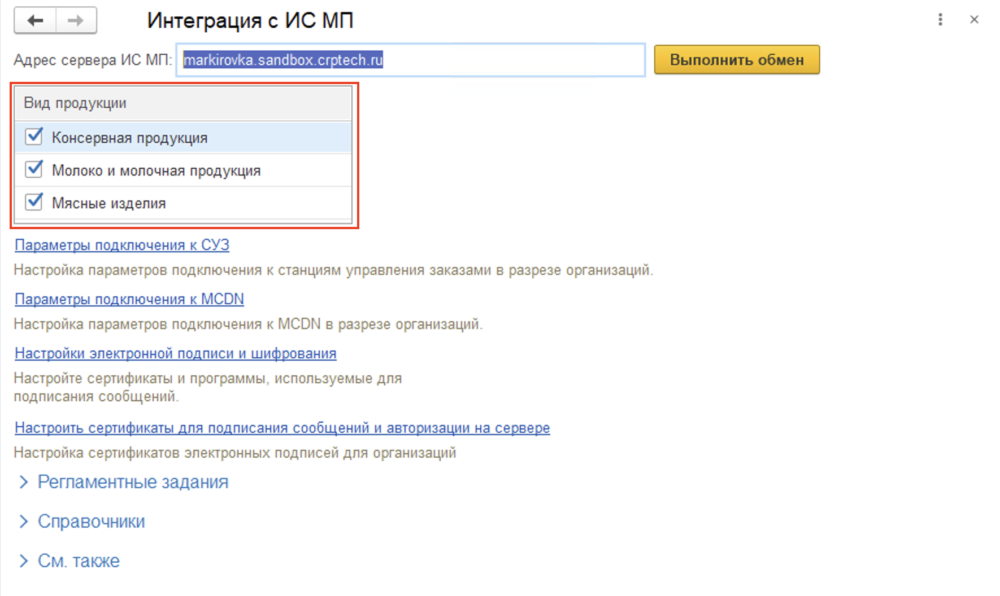

# Настройка номенклатуры

В карточке **Номенклатуры**, которую будем маркировать, надо заполнить информацию необходимую для работы с ЧЗ. 

Для активации работы с той или иной товарной категорией необходимо ее выбрать в настройках интеграции. Для этого нужно перейти в **"Интеграция с ИС МП (молоко)"** расположенной подсистеме **"Честный знак" - "Сервис"** и выбрать необходимые товарные категории.

На вкладке **"Честный знак"** заполняются:

- Вид продукции ИС МП;
- Код ТНВЭД (10 символов);
- Идентификатор этикетки ИС МП - необходимо заполнять при заказе кодов на типографию. Идентификатор этикетки ИС МП можно посмотреть в **СУЗ** - **Этикетки** - **Идентификатор этикетки**;
- Тип кода ИС МП: Единица товара, Групповая потребительская упаковка, Набор.

[![2020-12-13_16-02-04][2020-12-13_16-02-04]][2020-12-13_16-02-04]

В регистр **"Штрихкоды номенклатуры"** добавляем штрихкод **GTIN**, который соответствует коду товара в ЧЗ

[![2020-12-13_16-02-05][2020-12-13_16-02-05]][2020-12-13_16-02-05]

[2020-12-13_16-02-04]: Settings_SKU.assets/2020-12-13_16-02-04.png
[2020-12-13_16-02-05]: Settings_SKU.assets/2020-12-13_16-02-05.png