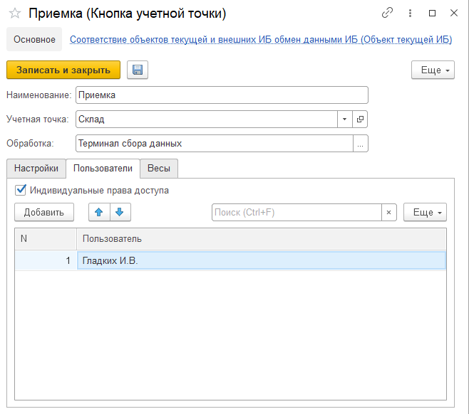
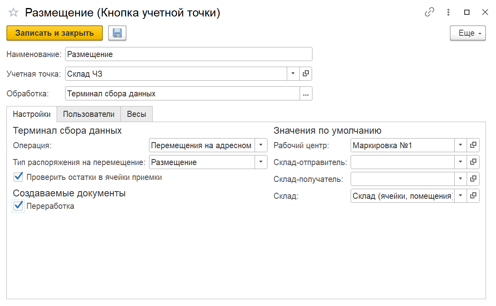

# Создание и настройка кнопок "Приемка" и "Размещение" 

<h2> Создание и настройка кнопки "Приемка" </h2>

Кнопка **"Приемка"** используется для приема на склад готовой продукции.

При создании кнопки учетной точки **"Приемка"** указываются:

- Наименование;
- Учетная точка;
- Обработка -Терминал сбора данных.

На вкладке **"Настройки"** заполняются:

- Операция - Приемка (Склад);
- Рабочий центр;
- Склад;
- Возможность создания упаковочного листа, в случае создания заполняются поля организация и макет для печати;
- Если создается Переработка, то необходимо заполнить склад-отправитель и склад-получатель.

На вкладке **"Пользователи"** можно настроить индивидуальные права доступа на данную команду.

<h2> Создание и настройка кнопки "Размещение" </h2>

Кнопка **"Размещение"** используется только на складах с адресной системой хранения. Применяется для перемещения продукции из ячейки приемки.

При создании кнопки учетной точки **"Размещение"** указываются:

- Наименование;
- Учетная точка;
- Обработка -Терминал сбора данных.

На вкладке **"Настройки"** заполняются:

- Операция - Перемещения на адресном складе (Склад);
- Тип распоряжения на перемещение - Размещение;
- Рабочий центр;
- Склад;
- Функциональная опция "Проверить остатки в ячейки приемки";
- Параметр создания Переработки (необходимо заполнить склад-отправитель и склад-получатель).

На вкладке **"Пользователи"** можно настроить индивидуальные права доступа на данную команду.