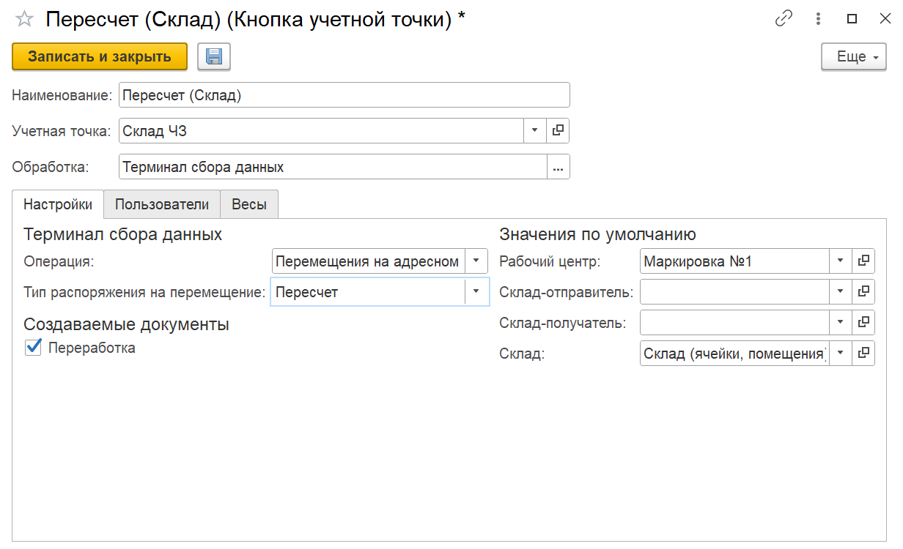

# Настройка кнопки учетной точки "Пересчет"

Кнопка **"Перемещение на адресном складе по типу Пересчет"** используется только на складах с адресной системой хранения.

Применяется для перемещения продукции на ячейку пересчета.

При создании кнопки учетной точки "Перемещение на адресном складе по типу Пересчет" указываются:

  - Наименование;
  - Учетная точка;
  - Обработка: Терминал сбора данных.

На вкладке "Настройки" заполняются:

  - Операция: Перемещения на адресном складе (Склад);
  - Тип распоряжения на перемещение: Пересчет;
  - Рабочий центр;
  - Склад;
  - Параметр для создания Переработки, при включении которой необходимо заполнить склад-отправитель и склад-получатель.

На вкладке **"Пользователи"** можно настраивать индивидуальные права доступа.
